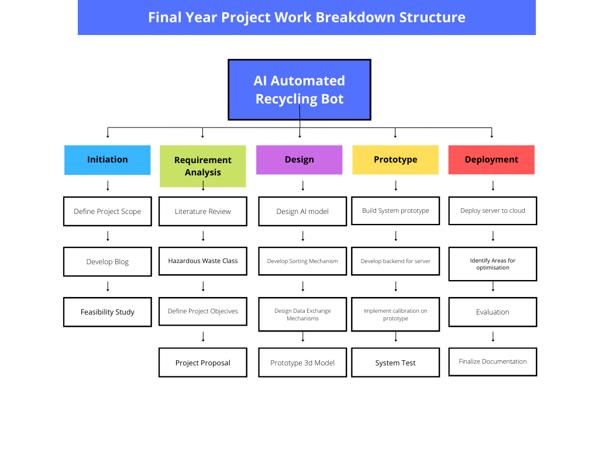

# Introduction

Now that my project proposal is complete, I can discuss it on this blog.
My project, Leveraging AI and Robotics to Build an Automated Waste
Recycling Bot, is a design solution targeted at helping the society recycle
its waste better by efficiently sorting waste classes accordingly.

My project targets harmful waste classes such as Plastic and Metal cans,
according to The Alliance, 2021. Only 15% of plastic is recycled. This
serves as a massive problem if left unchecked. You can read more about
my project and view my Gantt Chart in my Final Proposal
[here](https://drive.google.com/file/d/1GnsYqk4kHEB3t5XB9mV1vFehSwlkAUzh/view?usp=sharing).

Also take a look at my Work Breakdown structure below:

# Reflection

This week, I did a lot of research about my project and finished my
proposal; I also spent some time working on my Gantt Chart. The Gantt
Chart helped me understand what my project's timeline looked like. Now,
I can plan myself accordingly and ensure I successfully finish my
project.
