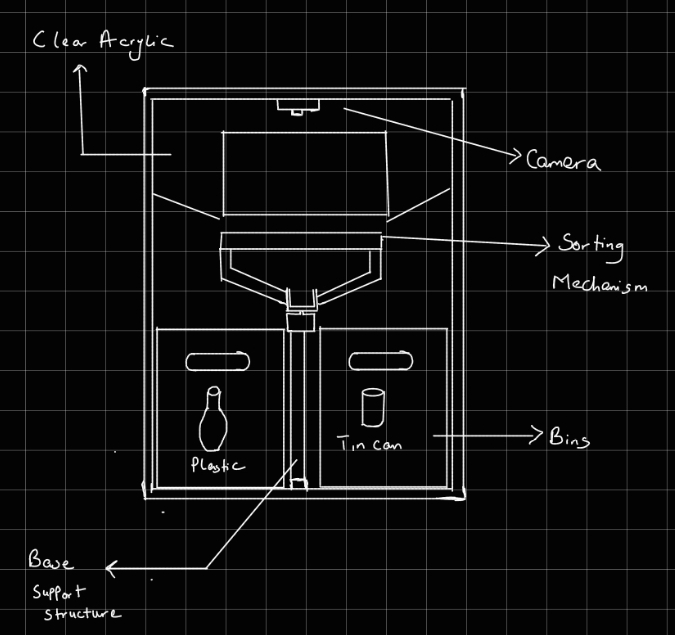

This week, we welcomed Ms Engie Bashir back into our classrooms to give
a session on UX & User testing. This session was focused on evaluation
via user testing and applying feedback from user tests to improve the UX
of the product. Ms. Engie explained the difference between formative and
Summative evaluation. Pointing out that the former is a method of
improving the system by continuously ensuring the user\'s needs are
understood and met with every improvement, and summative evaluation
checks the effectiveness of the final solution towards the user\'s
requirements.

She continued her session by highlighting different user test methods,
e.g., usability lab, field-based evaluation, etc. Finally, she ended her
session by explaining the data types to collate from users and the means
to analyse the data. E.g., frequency, mean, etc.

# Project Update

Quick project update here! I have made an illustration of my prototype
and started designing some components using Tinker CAD; once I am done
designing, I will use a 3d printer to print my designs. You can find the
illustration of my prototype below. It is just a concept; it will not
entirely portray the final design of the prototype, but it is a start!

# Reflection

This week, I learnt about the importance of user testing and its
contribution to UX; testing my product with users will be crucial to aid
in my formative and summative evaluations. I could set up a user testing
experiment to aid my summative evaluation if time permits.
