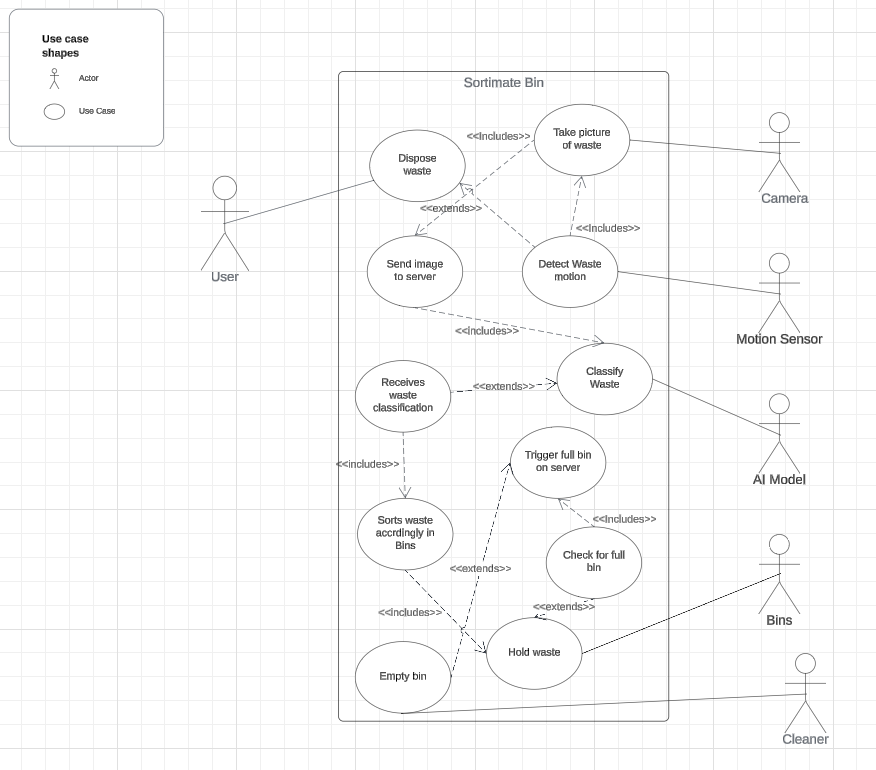
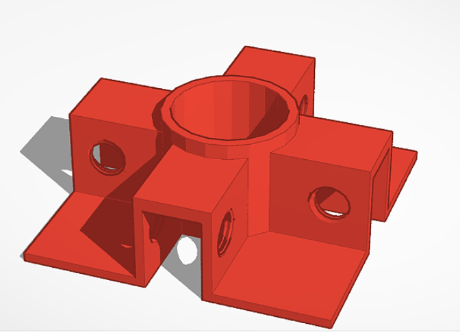
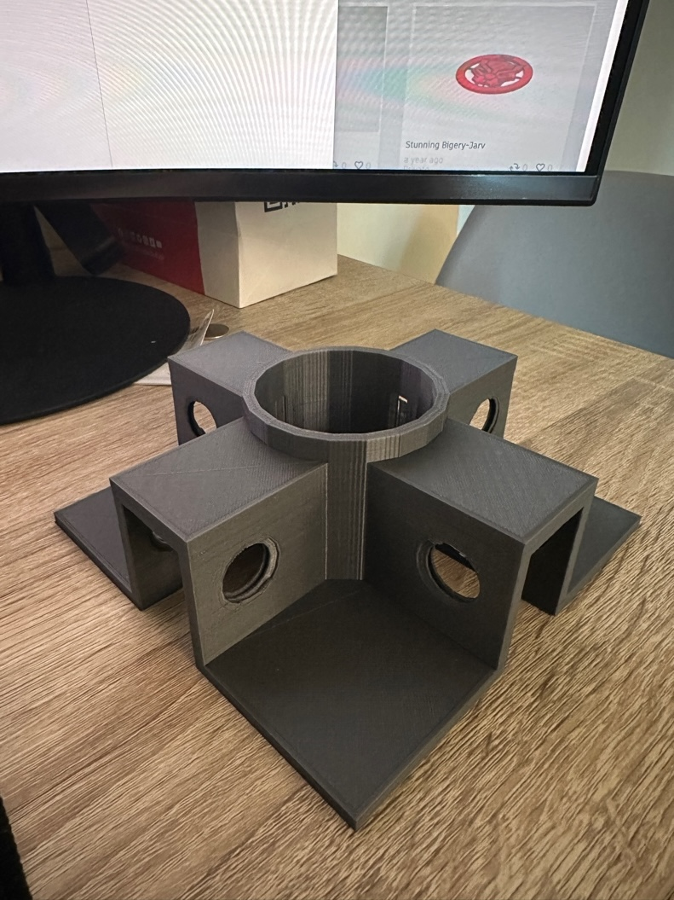
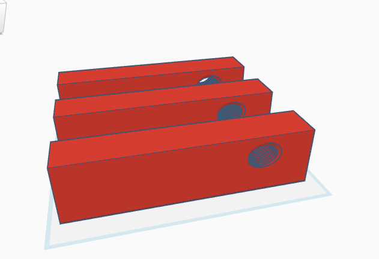

This week, I made a draft of my UML use case diagrams. The Use case
diagram allowed me to plan out the system\'s core functionalities and
identify the primary and secondary actors in the system. Thanks to the
use case diagrams, I can explain my project easily using a visual
prompt. I am also considering changing my bot\'s name from SpinBin to
SortiMate; what do you think? Anyway, find my use case diagram below.

# Project Update

After making my UML Use case diagrams, I also started designing the base
of my bot on Tinker CAD. I have 3D printed it, and the outcome was
pretty decent. The base will have three additional extensions to help
segregate the plastic, cans and other bins.

3D Modelled

3D Printed.

The extensions will be fixed using 12mm nuts and bolts to ensure a
sturdy base. This might make the bin heavier, but It will suffice in
this prototype.

In other news, I have also started purchasing the extra items I need for
my project; I got the Arduino Uno R4 with WiFi and BT capabilities, some
servo motors, a toolbox, motion sensors, ESP32 Cam + Wifi and so on, you
can find a picture of some of the things I ordered in the image below.

# Reflection

This week, I learned how to make a UML use case diagram and 3D printed a
model I worked on for my bot. I am making progress with my project, but
I am troubled that I may not be able to finish my project in time.
Hopefully, that's not the case. In other news, my team and I won the
Emirates Robotics Competition twice! You can read all about it in my
short LinkedIn post
[here](https://www.linkedin.com/posts/harith-onigemo_alhamdulillah-im-proud-to-announce-that-activity-7166475325235752960-wnXx?utm_source=share&utm_medium=member_desktop).
