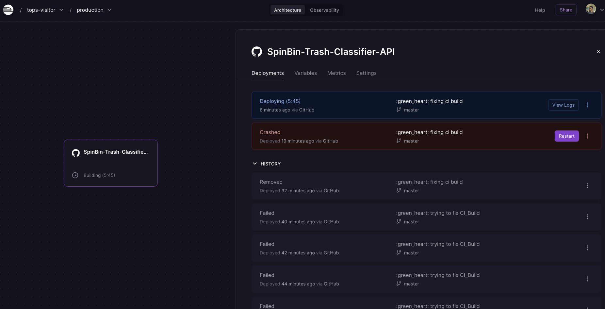
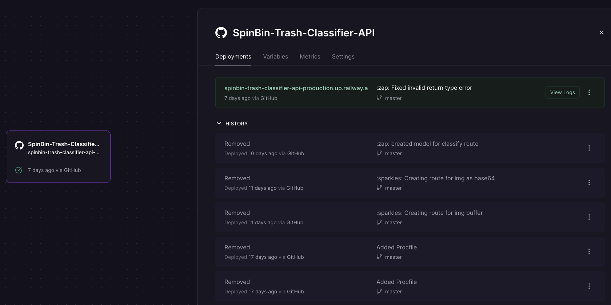
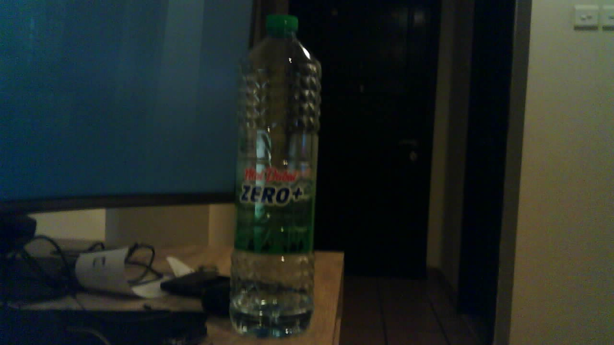
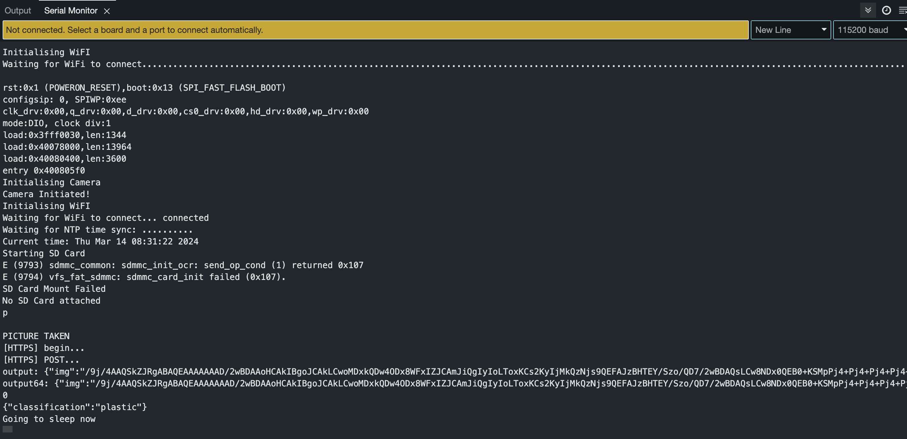

Last week, I had issues hosting the AI model API on the Railway cloud
server due to dependency issues from OpenCV. The version of OpenCV
(opencv-python) I was using locally required some GUI components for
compilation, which cannot be found on server environments. I researched
and asked around until I came across a friend who suggested I use the
opencv-contrib-python-headless. This package is smaller than the other
opencv-python packages and is built for server (headless) environments.
It also contains the main and contrib/extra modules my application
needs; after installing this opencv version to my project, deploying the
app on the railway server was successful.

Once the API was live, I decided to use the ESP 32 AI thinker module to
take pictures and send them over the internet via the API for inference.
To achieve the above objectives, I took the following steps.

1.  Use openssl to acquire a Root CA Certificate from my API domain to
    attach to the WifiClient on the ESP32 for HTTPS requests.

2.  Configure the ESP 32 camera to take pictures using the QVGA frame
    size for smaller file sizes.

3.  Encode the image taken from the ESP32 into base64 string and send
    the data as JSON to the API.

4.  Use the JsonSerialize Arduino library to encode the API payload into
    JSON format.

5.  Prep the API route to accept the base64 string and decode the string
    to an image for inference.

After taking the above steps, I could finally make a successful request
to the API after numerous days of debugging and research.

The Image

The Inference

# Project Update

1.  Hosted the API model on the cloud for HTTPS access.

2.  I have configured ESP32 to request the AI trash classifier API
    successfully.

3.  3D modelled and printed some additional parts of my prototype.

4.  I have started planning the electronic circuit of the prototype.

5.  I purchased perf boards and tools for the hardware implementation.

# Reflection

Hosting and configuring the AI model API has been challenging, but I am
glad I solved the issue. I realise now how important it is to network
and discuss the problems I may face in my projects, whether online or in
person, with robotics enthusiasts. Usually, I come across a tip that
would help me solve a bug I have been facing for a while. Moving
forward, I will engage in similar discussions to help or get technical
advice from the professionals.
