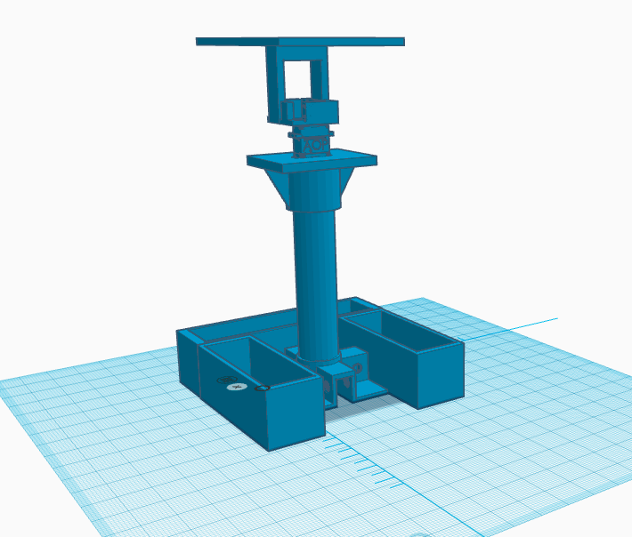

After setting up most of the software aspect of this project, it is time
to get our hands dirty with some hardware implementation. Okay, the AI
model is up and running on the cloud and ready for inference, but how do
we sort the waste after inference? This question troubled me until I
found a solution while scrolling through YouTube for inspiration.

This
[reel](https://landing-page-fsiz91x78-harith-onigemos-projects.vercel.app/)
showcases a pan and tilt servo kit that can rotate and tilt along the
angle range of a servo motor. This mechanism would suffice for finding
the correct bin and dumping the bin in the correct bin. After seeing the
video, I acquired the kit from Amazon and started assembly. Afterwards,
the idea began to come to life.

Since the prototype is supposed to segregate plastic and cans from other
waste materials, the sorting mechanism will need to tilt on both sides
for plastic or metal, then rotate and tilt to sort the other waste
types.

Okay, our sorting mechanism is now sorted. Next, we need to represent
how the prototype should look visually. I have been holding off on this
part of the project for a while because I find the software part of this
project more straightforward and familiar. Nonetheless, I am committed
to completing this project, so I have to deal with it.

I had ideas on how I wanted different parts of the project to look, but
I needed to figure out how everything would come together. So, I headed
to Tinker CAD and designed everything together. There are two main parts
of the prototype.

1.  The inner sorting mechanism

2.  The waste collector and identifier.

The inner sorting mechanism will contain the base, the support to hold
the sorting mechanism and the different bins to hold the waste.

Then, the outer waste collector chassis allows users to dump waste and
house the ESP32 camera to identify the waste. While I am still coming up
with how that part should look, the overall design should look like
this.

# Project update

1.  Designed the 3D model of the prototype.

2.  Figured out, the sorting mechanism.

3.  Started Coupling different hardware parts of the project.

4.  Completed circuit design for camera system (Will be discussed next
    week).

# Reflection

This week I started more work on the hardware aspect of the prototype,
this part of the project requires more thought and ingenuity to ensure
the solution works as expected. There is no guide for a project like
this, but I am grateful to the open source community for all the content
out there serving as inspiration to engineers like me.
