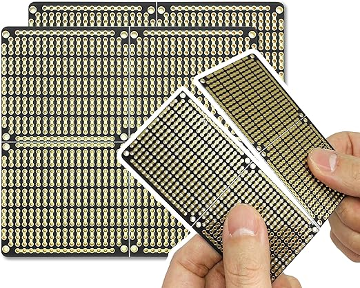
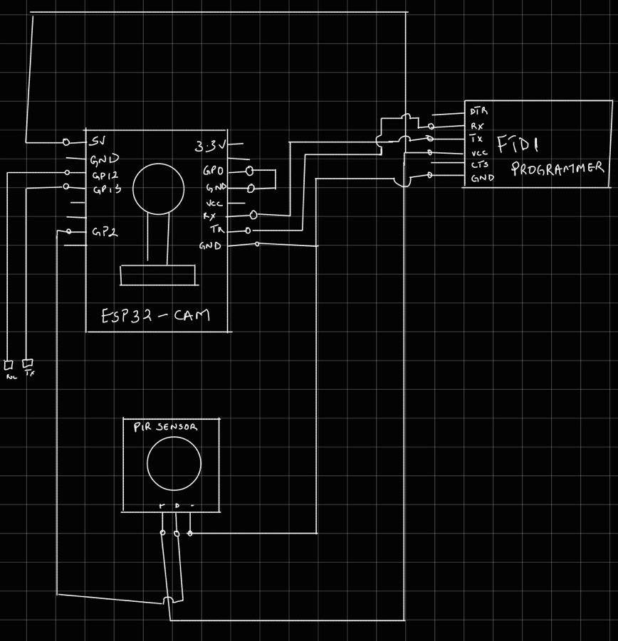
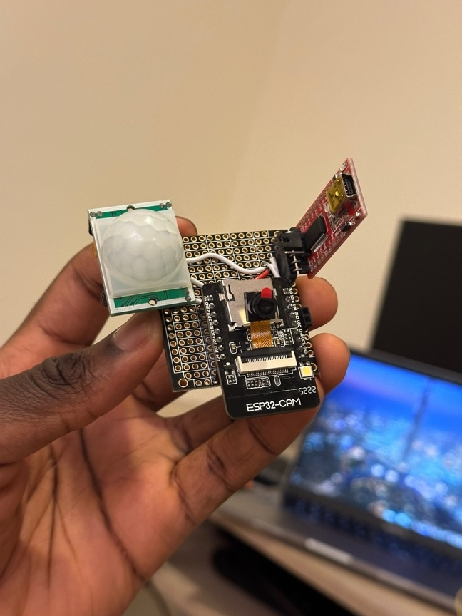
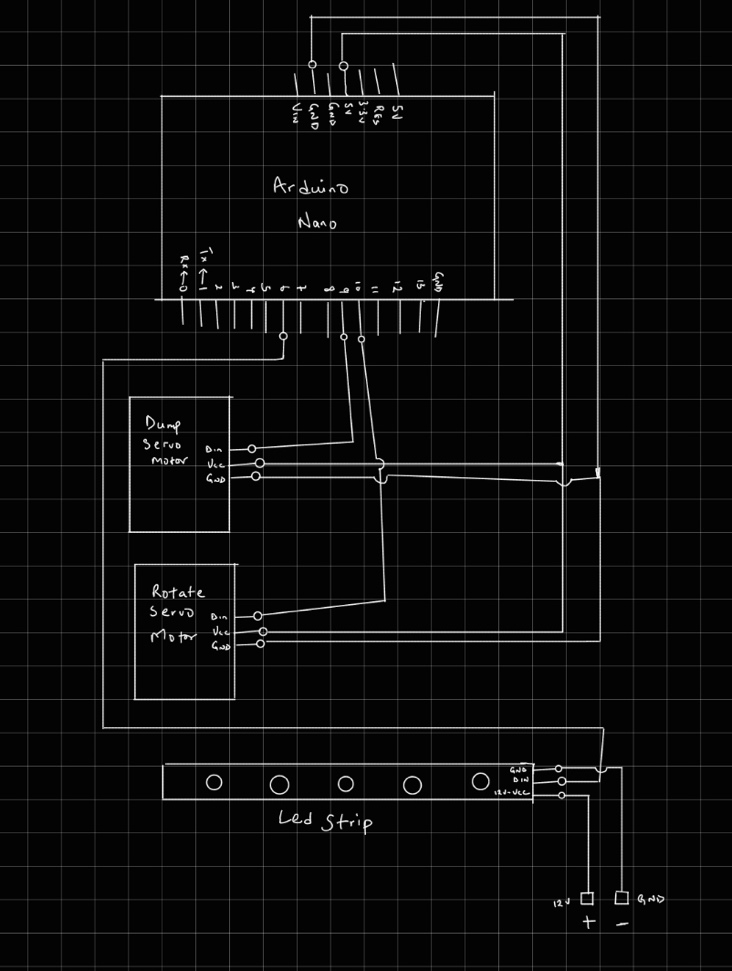
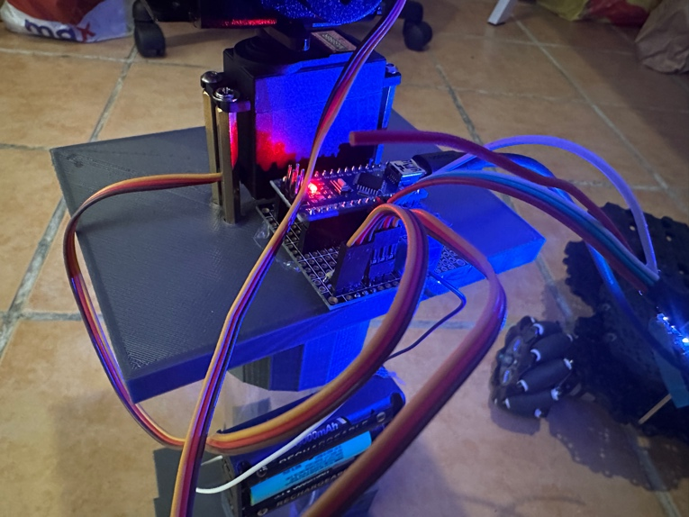
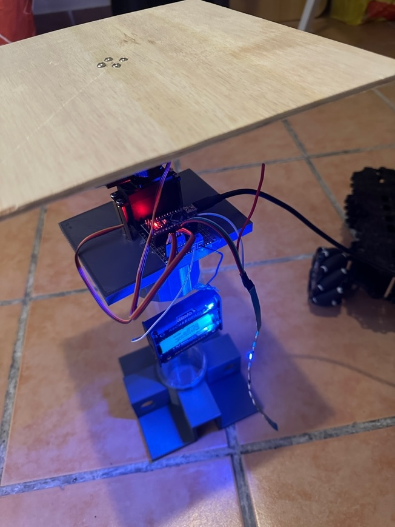

This week, I focused on designing the circuits I would use to detect
waste and control the sorting mechanism. My idea for the camera system
is to use an ESP 32 camera to take pictures and a PIR sensor to detect
motion in the SortiMate bot. I first tested it using breadboards and
jumper cables to implement the circuit, but this approach quickly looked
messy and fragile, especially with the number of jumper cables used.
Solving this issue would normally require a Printed Circuit Board (PCB),
but in the United Arab Emirates (UAE), PCB manufacturers are scarce, and
it takes a while to get the boards delivered. I resorted to perf boards,
which are cheaper and easily accessible. The only issue is that I'd have
to do much soldering.

Electro Cookie Prototype Board

I got the Electro Cookie board because it has power rails that work
similarly to a breadboard. After acquiring the board, I started planning
how each pin on the ESP 32 would be connected to allow the circuit to
work as expected. The final design can be found below.

After planning, I began soldering; after many solder and skin burns,
this was the outcome of the camera circuit.

Camera Circuit

From the above image, the camera circuit consists of a PIR sensor, an
ESP32 cam and an FTDI programmer. The FTDI programmer powers the entire
circuit, allowing the user to program the ESP32 cam easily.

The second circuit, which we shall call the Sort circuit, would comprise
an Arduino Nano, pins for the servo motors, LED strips, and an
additional component for supplying 12 volts to the LED strips.

Sorting Circuit Schematic

Thanks to this schematic, I could craft the sorting circuit easily; here
is the final design.\

Unit testing has been carried out on both circuits; we will carry out
integrated testing and observe next week. It is important to carry out
integrated testing to observe how well each circuit communicates with
each other using Software Serial.

# Project Update

1.  Soldered the camera and sorting circuit.

2.  Performed unit testing on both circuits and confirmed that it worked
    as expected.

3.  Started crafting the chassis of the entire prototype.

# Reflection

While I have completed the design for the individual circuits and
confirmed that they work as expected, I feel there might be some issues
with the software serial communication between each circuit; if there is
an issue, I might have to change the approach I use in detecting trash
submitted to the bot. We won't know until we try. Overall, I am content
that I made a custom PCB, especially after I doubted my soldering
skills. I have a newfound confidence in my soldering skills.
