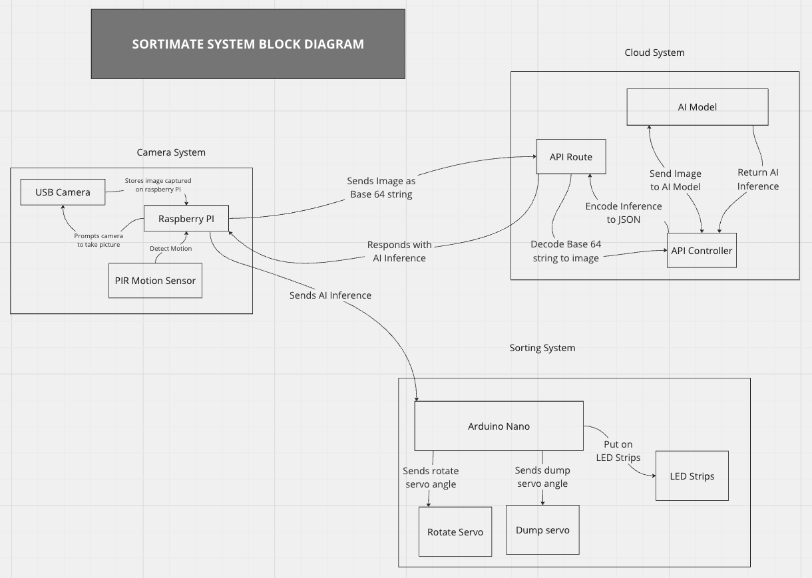

After testing the ESP Camera system, I noticed an issue that would not
allow the prototype to accomplish its goals. Each system has been
modularised to ensure that each system can work independently. However,
it is crucial that each of the systems can communicate with each other.
The ESP system is supposed to speak the AI inference to the sorting
system so the sorting system will know what to sort.

The ESP camera system would communicate with the sorting system using
Hardware Serial; this would entail using two pins on the ESP RX and TX
pins. The pins will be connected to the other Arduino using jumper
cables. While this method has worked in different projects, the
connection tends to be unstable and prone to errors. This issue will
render the prototype faulty if the communication between the ESP and
sorting systems fails.

Here is a block diagram of the entire system to help you understand how
everything works.

## New Camera System

After weighing my options, I got a Raspberry Pi and a USB camera, which
will be more expensive but more robust and reliable. The Raspberry Pi is
a mini computer that will allow me to leverage its GPIO and processor to
build a stronger camera system. The camera system now runs on Python and
works perfectly when taking images and communicating with the other
systems. Here is a block diagram of how the new system works.

# Project Update

- Finished the chassis for the prototype.

- I replaced the old camera system with a more reliable solution.

- Added LED feedback for knowing what the AI model inferred.

- I am 90% done with the project and will be rounding up soon.

# Reflection

After successfully integrating and testing the camera system, I wished I
had started with this approach sooner, as it simplified the entire
process and offered a better solution. The Raspberry Pi works perfectly,
and I will consider using one before any other alternatives if the
resources allow.
