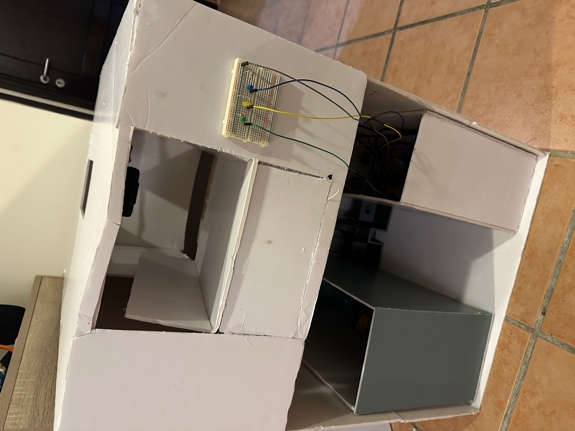
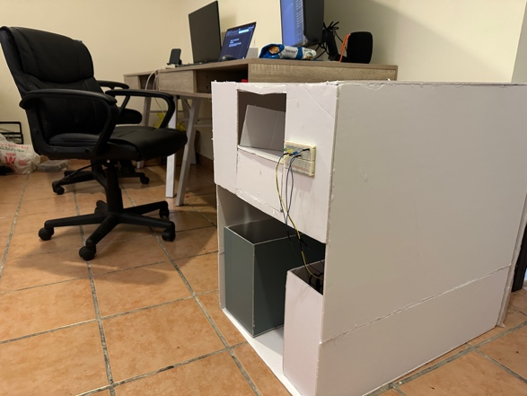
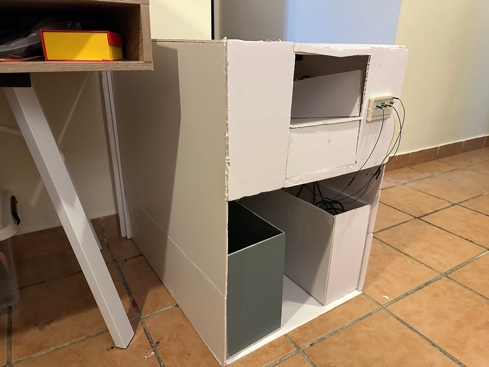
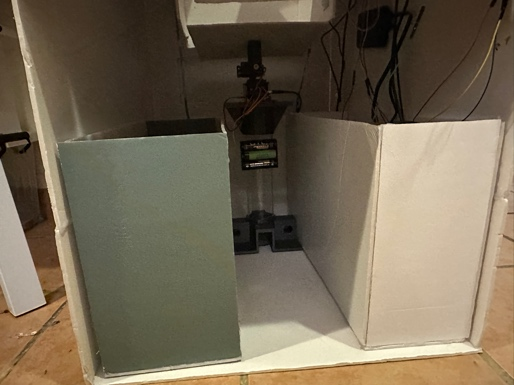
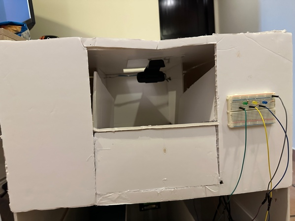

I have finally finished the project, and all functional requirements of
the project are satisfied. Although the project still has its
limitations, the project shows real promise in enhancing the recycling
process. You can find pictures of the finished prototype below.

In class, Dr Fehmida gave us some tips on organising our presentations
while emphasising what to do to ensure we pass our message across. She
advised us to consider the VIVA as a pitch for our projects. She also
informed us that the presentation will be online with our camera turned on. I hope I do my best on
the VIVA (by the way). VIVA is like a project defence for those who are
wondering.

Here is a short demo video of the project. If you read the entire blog,
you are real gee. Thank you so much and I hope this project has inspired
you one way or the other. See you at the top!!!

[Click here to watch video!](https://drive.google.com/file/d/15haI9JHn3cI0qiRkxbV_7Eekio5jlBiz/view?usp=sharing)
